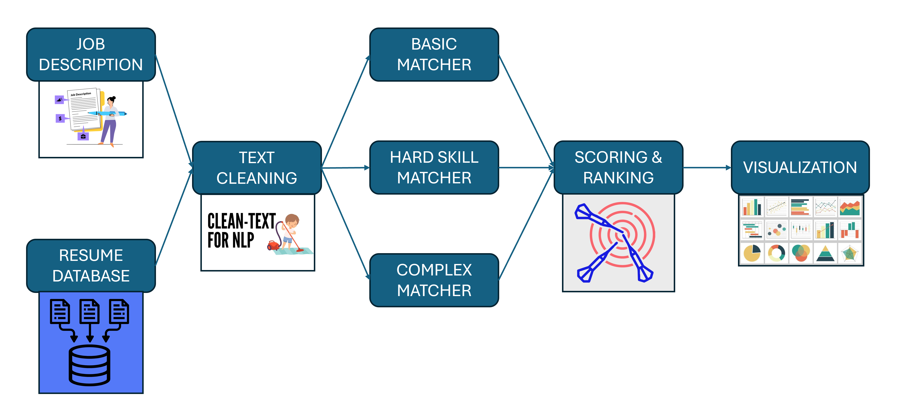
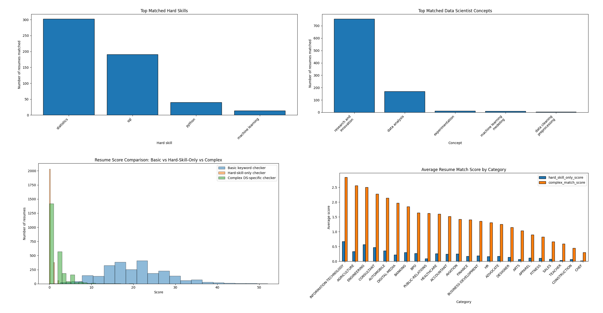
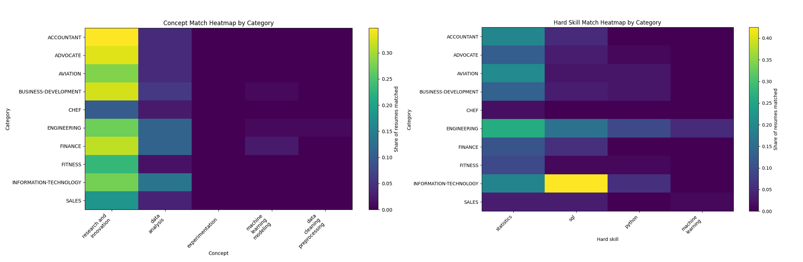
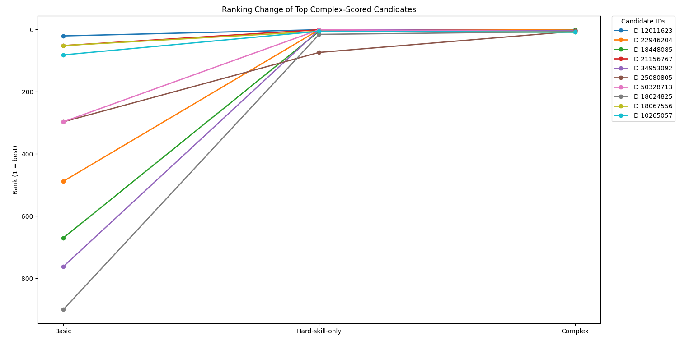

# Data Scientist Resume Matcher with Explainable NLP Ranking

This project builds an **explainable resume-screening pipeline** for a Data Scientist job posting. Instead of relying only on naive keyword overlap, the system compares resumes against a job description using three progressively stronger strategies:

1. **Basic keyword matching**
2. **Hard-skill matching**
3. **Concept-aware weighted matching**

The central question of the project is:

> **Can resume ranking be improved by moving from generic keyword overlap to role-specific, explainable scoring logic tailored to data science hiring?**

A second practical question is:

> **Which candidate profiles move up or down when we score for real data science capabilities instead of surface-level text overlap?**

---

## Project Objective

Recruiters and hiring managers often face two problems when screening resumes:

- keyword matching is fast but shallow,
- manual evaluation is richer but expensive and inconsistent.

This project aims to bridge that gap with a lightweight NLP pipeline that is **transparent, interpretable, and role-aware**. It reads a **job description** and a **database of resumes**, cleans the text, activates only the job-relevant skills and concepts, and then produces ranked candidate lists.

The goal is not to replace recruiters, but to build a more informative first-pass screening tool that better reflects how a Data Scientist profile is usually evaluated.

---

## Data Used

The project uses two inputs:

### 1. Job description
A text file containing the target role requirements for a **Data Scientist** position. The posting emphasizes:

- Python and SQL
- data analysis
- statistical modeling
- machine learning
- experimentation / A/B testing / causal inference
- communication with product and engineering teams
- end-to-end project delivery

### 2. Resume dataset
A resume database containing candidate texts and category labels. The code expects a text column such as `Resume_str` or `Resume.str`, and uses `Category` when available for grouped analysis. The resume dataset referenced in the project comes from Kaggle.

---

## Main Questions This Project Answers

When presenting this project, these are the core questions it answers:

1. **What problem does it solve?**  
   It improves early-stage resume screening for a specific Data Scientist role.

2. **Why is a simple keyword matcher not enough?**  
   Because generic overlap often rewards broad terms and misses deeper evidence of technical fit.

3. **How is the scoring made more realistic?**  
   By separating explicit hard skills from higher-level data science concepts and weighting them differently.

4. **How do we know the method changes ranking behavior?**  
   By comparing score distributions and rank changes between the three scoring systems.

5. **Why should a recruiter trust the results?**  
   Because the scoring logic is visible, feature-based, and explainable rather than a black box.

---

## Pipeline Overview

The workflow starts with a job description and a resume database, then passes through cleaning, matching, scoring, and visualization.

### Step-by-step logic

- **Job description parsing**: extract the language of the target role.
- **Text cleaning**: normalize case, punctuation, separators, and stop-like generic words.
- **Basic matcher**: compute plain job-description token overlap.
- **Hard-skill matcher**: detect explicit technical matches such as Python, SQL, statistics, and machine learning.
- **Concept matcher**: detect broader role-relevant patterns such as data analysis, experimentation, model building, communication, and research.
- **Scoring and ranking**: combine signals into increasingly informative ranking systems.
- **Visualization**: show which features dominate, which candidate categories perform best, and how rankings shift.

---

## Methods and Scoring Design

## 1. Text preprocessing
The project first normalizes the raw text:

- lowercasing
- replacing separators such as `/` and `-`
- removing noisy characters
- tokenization with simple regex rules
- removal of stopwords and generic non-informative terms

This reduces superficial variation and makes the comparison more stable.

## 2. Basic keyword score
The baseline approach computes overlap between cleaned job-description tokens and cleaned resume tokens.

This provides a useful reference point, but it has an important weakness: it cannot distinguish between genuinely valuable evidence and generic wording.

## 3. Hard-skill matcher
A curated dictionary is used to detect explicit technical skills relevant to Data Scientist roles, including patterns such as:

- Python
- SQL
- statistics
- machine learning
- cloud tools
- data visualization tools
- NLP, time series, ETL, Git, and others

Only the skills that are relevant to the active job description are emphasized.

## 4. Concept matcher
The more advanced layer searches for broader recruiter-relevant concepts, such as:

- data analysis
- machine learning modeling
- experimentation
- data cleaning / preprocessing
- visualization / reporting
- stakeholder communication
- business problem solving
- research and innovation
- deployment / MLOps

This helps capture candidates who describe real data science work even when they do not repeat the exact wording of the job ad.

## 5. Weighted complex score
The final ranking score combines the two structured layers:

- **hard skills** receive a higher weight,
- **concept matches** receive a complementary weight.

In the code, hard skills contribute more strongly than concepts, reflecting the idea that explicit technical fit should matter, but broader evidence of applied data science work should also influence ranking. The implementation calculates `complex_match_score` by combining weighted hard-skill and concept counts. fileciteturn1file0

---

## Why This Approach Is Better Than Naive Keyword Matching

A keyword matcher answers:

> “How many words from the job ad also appear in the resume?”

This project asks a more useful question:

> “How much evidence is there that this candidate actually matches the technical and conceptual requirements of a Data Scientist role?”

That distinction matters because resumes often contain:

- generic professional language,
- indirect descriptions of work,
- category-specific jargon,
- relevant concepts expressed without exact keyword overlap.

The concept-aware method therefore acts as a more structured approximation of recruiter reasoning.

---

## Results and Visual Evidence

## 1. What skills and concepts appeared most often?
The results show that among the activated hard skills, **statistics**, **SQL**, and **Python** were the most frequently matched. On the concept side, **research and innovation** and **data analysis** appeared most often in the resume pool for this job description.

This figure also compares the score distributions of the three ranking systems. The key takeaway is that the methods behave very differently:

- the **basic keyword checker** produces a wide score range,
- the **hard-skill-only checker** is much stricter,
- the **complex matcher** reintroduces richer discrimination by rewarding both technical skills and data science concepts.

That is an important project result: the richer matcher does not merely replicate the baseline; it changes how candidates are separated.

## 2. Which categories look strongest under the role-aware scoring?
Category-level analysis shows that average scores differ meaningfully across resume groups. Categories closer to technical and analytical work tend to score better under the complex method than many unrelated categories.

This demonstrates that the scoring logic is not random: it aligns more strongly with expected domain relevance.

## 3. What patterns appear in the heatmaps?
The heatmaps reveal how different resume categories express different kinds of evidence.

The main interpretation is:

- some categories show stronger **hard-skill signals**,
- others show stronger **conceptual signals**,
- highly relevant categories tend to have both.

This is useful because it moves the project beyond ranking individual resumes and into **pattern discovery across candidate groups**.

## 4. Do rankings actually change when the scoring becomes more intelligent?
Yes. The ranking-change plot shows that several candidates who are not strong under the basic approach move substantially upward under the hard-skill and complex methods.

This is one of the most important portfolio insights from the project. It demonstrates that the choice of scoring logic meaningfully affects who gets surfaced as a top candidate.

---

## Interpreting the Results

A good way to explain the project is:

- The **basic matcher** is a baseline for lexical overlap.
- The **hard-skill matcher** detects direct technical alignment.
- The **complex matcher** adds broader signals of real Data Scientist work.

So the final system is not just “counting more words.” It is **ranking candidates using a more role-aware representation of job fit**.

In practical terms, the project shows that:

- resumes can be ranked more meaningfully when technical skills and concepts are separated,
- category-level visualizations can reveal where candidate pools are concentrated,
- explainable scoring is possible without using a black-box model.

---

## Repository Logic

The main script performs the following tasks:

- loads the resume dataset and job description,
- normalizes and tokenizes text,
- activates job-relevant hard skills and concepts,
- scores every resume with three matching approaches,
- computes rank changes,
- saves output tables,
- generates portfolio-style visualizations. fileciteturn1file0turn1file1

It also exports CSV outputs such as:

- full ranking tables,
- top-10 candidate summaries,
- a portfolio summary table. fileciteturn1file0

---

## Strengths of the Project

This project is strong for a portfolio because it demonstrates several practical data science skills at once:

- **text preprocessing** for noisy real-world text,
- **rule-based NLP design**,
- **feature engineering**,
- **scoring-system construction**,
- **comparative evaluation of methods**,
- **data visualization**,
- **explainability and transparent ranking**.

It also solves a business-relevant problem: improving resume screening in a way that is interpretable for recruiters and hiring teams.

---

## Limitations

This project is intentionally lightweight and explainable, so it has several limitations:

- it is **rule-based**, not semantic,
- it depends on the coverage and quality of the predefined hard-skill and concept dictionaries,
- it does not understand nuanced context the way embedding-based or transformer-based retrieval systems can,
- it does not learn from historical hiring outcomes,
- it may still reward keyword stuffing if the rules are not carefully tuned.

These limitations are worth stating because they show you understand where the method works and where it should be improved.

---

## Future Improvements

Possible next steps include:

- sentence embeddings for semantic similarity,
- section-aware parsing of resumes,
- weighting by years of experience or evidence strength,
- deduplication of overlapping concepts,
- calibration against recruiter labels,
- hybrid systems that combine rules with learned ranking models,
- fairness and bias analysis for hiring-related applications.

---

## One-Minute Explanation

Here is a compact way to explain the project in an interview or on a portfolio page:

> I built an explainable NLP-based resume matcher for Data Scientist roles. The project compares a job description against a resume database using three methods: a basic keyword matcher, a hard-skill matcher, and a concept-aware weighted matcher. The core idea was to show that naive keyword overlap is not enough for candidate ranking, because it misses deeper evidence of technical and analytical fit. I designed dictionaries for hard skills and data science concepts, activated the parts relevant to the job description, and then ranked candidates based on weighted matches. The results showed meaningful differences in score distributions and candidate ranking, especially when moving from simple overlap to role-aware scoring. The project demonstrates text preprocessing, feature engineering, explainable scoring, and visualization for recruitment analytics.

---

## Dataset Source

The resume dataset referenced in the project is:

- **Kaggle Resume Dataset**: https://www.kaggle.com/datasets/snehaanbhawal/resume-dataset

The target job description used in the example emphasizes product-facing data science work, experimentation, machine learning, statistics, Python, SQL, and communication with engineering and product teams. fileciteturn1file1
